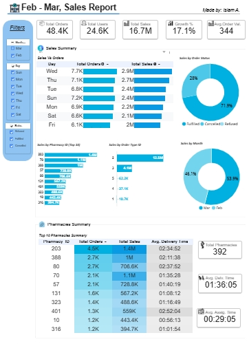

  
# 📊 Data Analytics Portfolio

  

  
  
  
  

---

## 🛠️ Technology Stack

  
<table>
  <tr>
    <td align="center" width="96">
      
       <b>Python</b>
    </td>
    <td align="center" width="96">
      
       <b>Excel</b>
    </td>
    <td align="center" width="96">
      
       <b>Google Sheets</b>
    </td>
    <td align="center" width="96">
      
       <b>Looker Studio</b>
    </td>
    <td align="center" width="96">
      
       <b>Power BI</b>
    </td>

  </tr>
  <tr>
    <td align="center" width="96">
      
       <b>Google Analytics</b>
    </td>
    <td align="center" width="96">
      
       <b>Pandas</b>
    </td>
    <td align="center" width="96">
      
       <b>NumPy</b>
    </td>
    <td align="center" width="96">
      
       <b>Seaborn</b>
    </td>
    <td align="center" width="96">
      
       <b>Matplotlib</b>
    </td>
  </tr>
</table>

 

---

## 💡 Key Competencies

<table>
<tr>
<td align="center" width="25%">

 <b>Data Analysis</b>
 <i>Statistical Analysis, EDA, Insights</i>
</td>
<td align="center" width="25%">

 <b>Data Cleaning</b>
 <i>ETL, Preprocessing, Validation</i>
</td>
<td align="center" width="25%">

 <b>Visualization</b>
 <i>Dashboards, Charts, Storytelling</i>
</td>
<td align="center" width="25%">

 <b>Feature Engineering</b>
 <i>Feature Selection, Transformation</i>
</td>
</tr>
</table>

 

---

## 📈 Reports & Dashboards

 

###  Excel Dashboards

> **Interactive dashboards built with advanced Excel functions, power pivot, power query, pivot tables, and visualizations**

 

<b>📊 FNP Sales Analysis Dashboard</b>

 

 

<b>🏪 Store Sales Analysis Dashboard</b>

 

 

<b>📉 Customer Churn Analysis Dashboard</b>

 

 

---

###  Power BI Dashboards

> **Dynamic and interactive business intelligence reports for data-driven decision making**

 

#### 📊 2022-2023 Sales Analysis

**Features:**

- 🎯 KPI tracking
- 📈 Year-over-year comparisons

 

---

###  Looker Studio Reports

> **Cloud-based interactive dashboards with real-time data connectivity**

 

#### 📱 Google Analytics Report

**Insights Tracked:**
- 👥 User Behavior Patterns
- 📊 Traffic Sources
- 🎯 Conversion Metrics

 

#### 💊 Pharmacies Sales Dashboard

  

**Dashboard Highlights:**
- 📊 Sales Performance Tracking
- 🗓️ Time-based Analysis
- 💹 Revenue Trends

 

---
## 🐍 Python & ETL Pipelines

> **Data analysis using Python, featuring data cleaning, visualization, and feature engineering**

<table width="100%">
<tr>
<td align="center" width="33%">

### 🛒 e-commerce Analysis

Discovering customer behaviour on e-commerce platforms through comprehensive data cleaning, visualization, and feature engineering to capture hidden patterns and insights.

**Key Skills:**
- 📊 Customer Segmentation
- 🔍 Behavioral Analysis
- 📈 Trend Identification

</td>

<td align="center" width="33%">

### 💊 Pharmacies Sales Analysis

Analyzed sales data from pharmacies to identify trends, optimize inventory management, and improve profitability through data-driven decisions.

**Key Skills:**
- 📦 Inventory Optimization
- 💰 Revenue Analysis
- 📊 Sales Forecasting

</td>

<td align="center" width="33%">

### 🚕 Taxi Rides Analysis

Analyzed taxi rides data to optimize routes, improve driver efficiency, and enhance the overall user experience through actionable insights.

**Key Skills:**
- 🗺️ Route Optimization
- ⏱️ Efficiency Metrics
- 👥 User Experience

</td>
</tr>
</table>

 

---

  <i>⭐ If you find these projects insightful, consider giving a star!</i>

